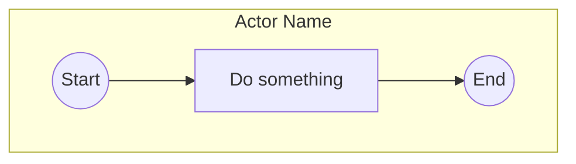

# CRITICAL: Mermaid Syntax Error - Reserved Keyword Conflict

## Status: 🔴 CRITICAL BUG

**Date**: 2025-11-18
**Severity**: BLOCKING - Prevents ALL diagrams from rendering

---

## Error Message

```
Parse error on line 15:
...iskStyle     end({End})     end
-------------------^
Expecting 'SEMI', 'NEWLINE', 'SPACE', 'EOF', 'subgraph', 'end', 'acc_title', 'acc_descr'
```

---

## Root Cause Analysis

### The Problem: Reserved Keyword Conflict

**Mermaid.js reserves the keyword `end` for closing subgraphs.**

When we generate this syntax:
```mermaid
subgraph salesman["Salesman"]
    start((Start))
end  <-- This closes the subgraph

subgraph orderEntry["Order Entry"]
    step1[Generate Order]
    end((End))  <-- ERROR! "end" is treated as subgraph closer, not a node ID
end  <-- This is now unexpected
```

Mermaid parser sees:
1. `subgraph salesman` → Opens subgraph
2. `end` → Closes subgraph ✅
3. `subgraph orderEntry` → Opens subgraph
4. `end((End))` → **TRIES TO CLOSE SUBGRAPH** (because `end` is reserved)
5. `end` → **UNEXPECTED** (subgraph already closed)

### Why This Happens

**File**: [`src/utils/mermaidGenerator.ts`](src/utils/mermaidGenerator.ts)

#### Line 77: Subgraph syntax
```typescript
lines.push(`    subgraph ${sanitizeId(actor.id)}["${swimlaneLabel}"]`);
```

#### Line 85: Closing with reserved keyword
```typescript
lines.push('    end');  // <-- Reserved keyword
```

#### Lines 108-111: Node ID generation
```typescript
case 'end':
  shape = `${nodeId}((${label}))`; // nodeId is "end" - CONFLICT!
  break;
```

When `nodeId` is `"end"`, it generates:
```mermaid
end((End))  // Mermaid thinks this is closing subgraph!
```

### Same Issue with `start`

The keyword `start` might also conflict in some Mermaid versions, though `end` is the immediate blocker.

---

## Solution: Change Node IDs to Non-Reserved Names

### Option 1: Prefix Reserved Keywords ✅ RECOMMENDED

Change node IDs from `start`/`end` to `node_start`/`node_end` in the Mermaid output ONLY.

**Pros**:
- ✅ Simple fix in one location
- ✅ No AI prompt changes needed
- ✅ No JSON schema changes needed
- ✅ Backward compatible

**Cons**:
- ⚠️ ID mismatch between JSON and diagram (acceptable since it's internal)

### Option 2: Change AI to Use Different IDs

Tell AI to use `startNode`/`endNode` instead of `start`/`end`.

**Pros**:
- ✅ Consistent IDs throughout

**Cons**:
- ❌ Requires AI prompt changes (just fixed!)
- ❌ May still generate `start`/`end` sometimes
- ❌ Doesn't fix existing JSONs

### Option 3: Use Mermaid Node ID Escaping

Mermaid supports escaped IDs, but syntax is complex and error-prone.

**Cons**:
- ❌ Complex syntax
- ❌ May not work with subgraphs

---

## Implementation Plan: Option 1 (Prefix Reserved Keywords)

### Change 1: Update `sanitizeId()` Function

**File**: [`src/utils/mermaidGenerator.ts`](src/utils/mermaidGenerator.ts)
**Line**: 256-258

**Current**:
```typescript
function sanitizeId(id: string): string {
  return id.replace(/[^a-zA-Z0-9_-]/g, '_');
}
```

**New**:
```typescript
function sanitizeId(id: string): string {
  // Replace special chars
  let sanitized = id.replace(/[^a-zA-Z0-9_-]/g, '_');

  // Prefix reserved Mermaid keywords to avoid conflicts
  const RESERVED_KEYWORDS = ['start', 'end', 'subgraph', 'graph', 'flowchart', 'class', 'style'];
  if (RESERVED_KEYWORDS.includes(sanitized.toLowerCase())) {
    sanitized = `node_${sanitized}`;
  }

  return sanitized;
}
```

**Effect**:
- JSON: `{"id": "start", "type": "start", ...}`
- Mermaid: `node_start((Start))`
- ✅ No syntax conflict!

### Change 2: Ensure Flow References Are Consistent

**File**: Same file
**Lines**: 153-165 (buildFlows function)

Flows already use `sanitizeId()` for both `from` and `to`, so they'll automatically use the prefixed IDs:
```typescript
const fromId = sanitizeId(flow.from);  // "start" → "node_start"
const toId = sanitizeId(flow.to);      // "end" → "node_end"
```

✅ **No changes needed** - flows will work automatically!

### Change 3: Add Test for Reserved Keywords

Create test cases to ensure reserved keywords are handled correctly.

---

## Testing Plan

### Test Case 1: Simple Process with Start/End
```json
{
  "steps": [
    {"id": "start", "type": "start", "label": "Start", ...},
    {"id": "step1", "type": "action", "label": "Do something", ...},
    {"id": "end", "type": "end", "label": "End", ...}
  ],
  "flows": [
    {"from": "start", "to": "step1"},
    {"from": "step1", "to": "end"}
  ]
}
```

**Expected Mermaid**:


**Validation**: ✅ No parse errors

### Test Case 2: Multiple Actors with Start/End
- Start node in Actor 1
- End node in Actor 3
- Flows cross actors

**Expected**: ✅ Renders correctly

### Test Case 3: Process with Other Reserved Words
If someone names a step "graph" or "subgraph" (unlikely but possible).

**Expected**: ✅ Prefixed to `node_graph`, `node_subgraph`

---

## Files to Modify

1. **[`src/utils/mermaidGenerator.ts`](src/utils/mermaidGenerator.ts)**
   - Line 256-258: Update `sanitizeId()` function
   - Add RESERVED_KEYWORDS constant
   - Add prefix logic

2. **Testing** (optional but recommended)
   - Create unit test for `sanitizeId()` with reserved keywords
   - Test end-to-end rendering with start/end nodes

---

## Why Phase 1 Didn't Solve This

Phase 1 fixed the **AI not generating start/end nodes** problem.

Now AI is correctly generating:
```json
{"id": "start", "type": "start", ...}
{"id": "end", "type": "end", ...}
```

But this exposed a **hidden bug in the Mermaid generator**:
- The generator was never tested with actual start/end nodes!
- When it tries to create `end((End))` inside a subgraph, Mermaid syntax breaks
- This is a **code-level bug**, not a prompt issue

---

## Estimated Fix Time

- **Implementation**: 5 minutes (one function change)
- **Testing**: 10 minutes (verify with existing test cases)
- **Total**: ~15 minutes

---

## Success Criteria

After implementing the fix:

- ✅ Diagrams with start/end nodes render without parse errors
- ✅ Flows connect properly using sanitized IDs
- ✅ No regression on existing functionality
- ✅ JSON IDs remain unchanged (only Mermaid output is modified)

---

## Priority

**URGENT** - This blocks all diagram rendering after Phase 1 deployment.

The Phase 1 fix correctly made AI generate start/end nodes, but the Mermaid generator can't handle them due to reserved keyword conflict.

**This must be fixed before any testing can proceed.**
